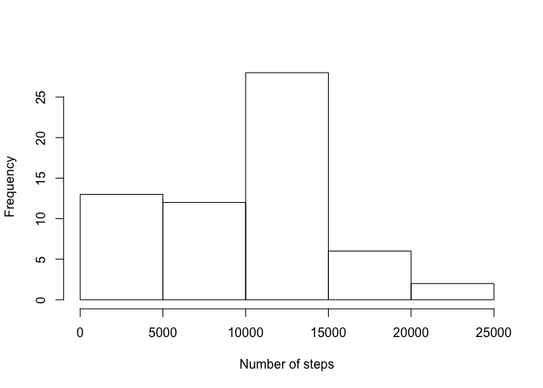
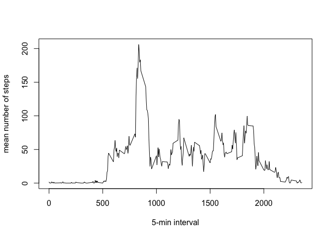
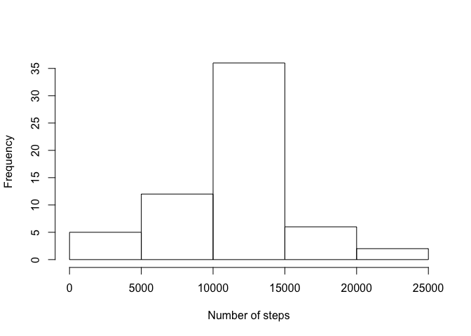
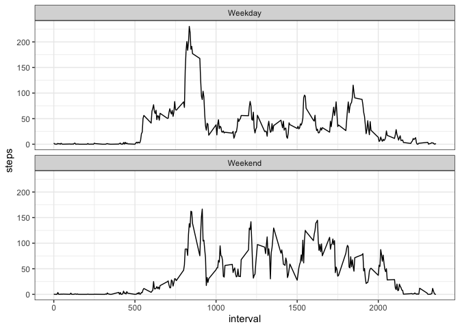

## Loading and preprocessing the data

```r
activity <- read.csv("activity.csv", na.strings = "NA")
```

You can see first few rows here

```r
head(activity)
```

```
##   steps       date interval
## 1    NA 2012-10-01        0
## 2    NA 2012-10-01        5
## 3    NA 2012-10-01       10
## 4    NA 2012-10-01       15
## 5    NA 2012-10-01       20
## 6    NA 2012-10-01       25
```

## What is mean total number of steps taken per day?
Here we first group the data by date. After that we create a histogram of the total number of steps taken each day


```r
library(dplyr)
```

```
## 
## Attaching package: 'dplyr'
```

```
## The following objects are masked from 'package:stats':
## 
##     filter, lag
```

```
## The following objects are masked from 'package:base':
## 
##     intersect, setdiff, setequal, union
```

```r
grouped <- group_by(activity, date)
sum_steps <- aggregate(grouped$steps, by = list(activity$date) , FUN = sum, na.rm = T)
names(sum_steps) <- c("date", "total.steps")
hist(sum_steps$total.steps, xlab = "Number of steps", main = "")
```

<!-- -->

Here's the **mean** total number of steps taken per day

```r
mean(sum_steps$total.steps)
```

```
## [1] 9354.23
```

Here's the **median** total number of steps taken per day

```r
median(sum_steps$total.steps)
```

```
## [1] 10395
```

## What is the average daily activity pattern?

```r
mean_steps <- aggregate(grouped$steps, by = list(activity$interval) , FUN = mean, na.rm = T)
plot(mean_steps$Group.1, mean_steps$x, type = "l", xlab = "5-min interval", 
     ylab = "mean number of steps")
```

<!-- -->

Maximum 5 min interval, on average across all the days in the dataset, containing the maximum number of steps:

Max **interval** is 

```r
max_id <- which.max(mean_steps$x)
mean_steps$Group.1[max_id]
```

```
## [1] 835
```

with the **number of steps**

```r
mean_steps$x[max_id]
```

```
## [1] 206.1698
```

## Imputing missing values

### Total number of missing values

```r
sum(is.na(activity[,1]))
```

```
## [1] 2304
```


### Here we create a function to replace na values with mean value of the interval

```r
replace_na <- function(){
    result <- vector()
    for (i in 1:length(activity$steps)){
        if (is.na(activity[i, 1])){
            result <- c(result, mean_steps[mean_steps$Group.1 == activity$interval[i],2])
        } else {
            result <- c(result, activity$steps[i])
        }
    }
    result
}
```

Then we create a new data set, where na values are replaces with the mean value. The new data set is called activity_full


```r
activity_full <- activity
activity_full$steps <- replace_na()
```

Here we make a **new** histogram

```r
grouped <- group_by(activity_full, date)
sum_steps_full <- aggregate(grouped$steps, by = list(activity_full$date) , FUN = sum)
names(sum_steps_full) <- c("date", "total.steps")
hist(sum_steps_full$total.steps, xlab = "Number of steps", main = "")
```

<!-- -->

Before replacing NA values:

mean

```r
mean(sum_steps$total.steps)
```

```
## [1] 9354.23
```
median

```r
median(sum_steps$total.steps)
```

```
## [1] 10395
```

After replacing NA values

mean

```r
mean(sum_steps_full$total.steps)
```

```
## [1] 10766.19
```
median

```r
median(sum_steps_full$total.steps)
```

```
## [1] 10766.19
```

There's difference in both mean and median values


## Are there differences in activity patterns between weekdays and weekends?


```r
weekend <- c("Saturday", "Sunday")
weekday_type <- function(x){
    if (weekdays(x) %in% weekend){
        return ("Weekend")
    }else {
        return ("Weekday")
    }
}
activity_full$day_type <- as.factor(sapply(as.Date(as.character(activity_full$date)),weekday_type))
```

Making a plot on weekdays/weekends

```r
mean_steps <- aggregate(steps ~ interval + day_type, activity_full, mean)
library(ggplot2)
ggplot(mean_steps, aes(x = interval, y = steps)) + 
    geom_line() + facet_wrap(~day_type, ncol = 1) + theme_bw()
```

<!-- -->


